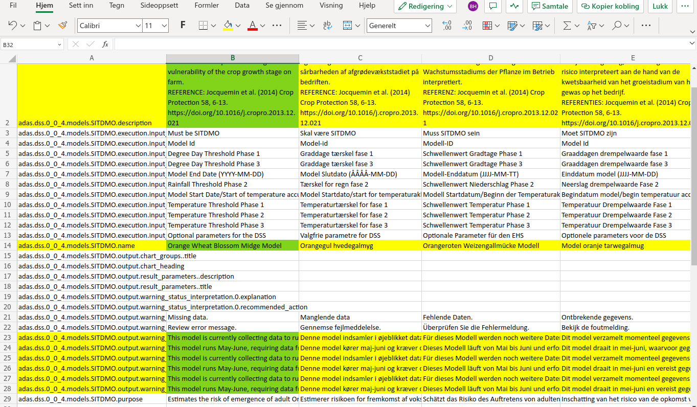

# Internationalization of the API
The DSS metadata contains a lot of verbal content: Descriptions, titles etc that are used throughout the platform, hence they need translations to as many languages as possible. Internally, the translations are stored as ResourceBundles, which is a Java native way of keeping track of translations.

Translations are stored in CSV files, one file per Source DSS. E.g. VIPS has one file for all DSS models, SEGES has one, ADAS one etc. To ease the process for non-technical personell, the process has (hopefully) been grossly simplified. The old documentation (which is still valid) can be found [here](./i18n_old.md)

## Information for translators
You will perform the translations using Excel in the cloud. Do not download copies of the files, edit them directly in the cloud (Teams). So, for instance



The translations are key-based, using a namespace that is built up like this:

```
[DSS Source ID].[DSS source version].models.[Model ID].[property.path]
```
For instance 

```
no.nibio.vips.2_0.models.DELIARADIC.description
```

If you are adding your language for the first time to a DSS, all cells in your column (which you create yourself) must be filled in. If you are editing a translation, only the cells that have been changed (marked with a yellow background colour) need to be edited. **When you are done, set the background color of your cells to green to signal that work on this/these cell(s) is complete.**

## Translation workflow (technical)
Assuming that a metadata file has been created for the new DSS

### Add to repository
Create a branch of DSS-Metadata that reflects this addition, named e.g. `add-DSS_ID` or `update-DSS_ID` or `Release-YYYY-MM`

### Creating or updating the CSV file
Using the Python script `./i18n/yaml_to_csv.py`, you can extract the translatable YAML properties into a CSV file used for further processing. Example usage:

```
[...]/i18n $ ./yaml_to_csv.py ../SEGES.yaml
```

The (updated) CSV file will be stored in the `i18n/csv_from_yaml` folder

**Make sure all active YAML files are processed if this is a release branch**

### Create an Excel file to be uploaded 

You have to convert the CSV to Excel by using the script `i18n/csv_to_excel.py`. The produced files can be found in the `excel_to_translation` folder. Example usage:

```bash
$ csv_to_excel.py csv_from_yaml/*.csv
```

Then you have to identify modifications (use a diff tool) in the YAML files from the master branch. Also control the corresponding CSV files produced from YAML. Highlight in yellow in the Excel 

Upload the Excel files to a Teams or Sharepoint where the translators can work on the same file simultaneously.

### Download edited Excel files
Download the Excel files from the cloud to `excel/from_translation`


### Convert from Excel to CSV

Use the `i18n/excel_to_csv.py` script to convert all the completed Excel files back to CSV

```bash
$ excel_to_csv.py excel_from_translation/*.csv
```
The files will be stored in `csv_from_excel/`


### Convert from CSV to properties
Use the `csv_to_properties.py` script

```bash
$ csv_to_properties.py csv_from_excel/*.csv
```

### Push (and merge) the branch
TODO