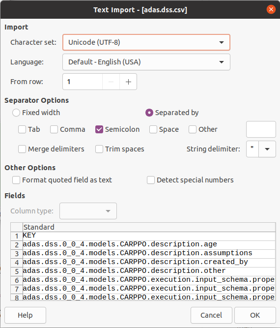

# Internationalization of the API
The DSS metadata contains a lot of verbal content: Descriptions, titles etc that are used in the platform, hence they need translations to as many languages as possible. Internally, the translations are stored as ResourceBundles, which is a Java native way of keeping track of translations.

Creating the translations for one DSS is done by editing a CSV file e.g. using a spreadsheet such as LibreOffice or Excel. It is important that the CSV format is kept throughout the process, so remember to save as or export CSV from your spreadsheet when handing over to the development team.

## Who does what
Translators (non-technical participants) performs step 2 (Translation). WP2 and WP3 participants assist, performing steps 1, 3 and 4. When in doubt, translators should consult with WP2 leader Tor-Einar Skog and WP3 leader Dave Skirvin to get assistance.

## Translation workflow

### 1. Translation initialization
**The development team is responsible for this.** It involves sending a request to `[DSS_API_URL]/rest/admin/dss/{DSS-id}/i18n/csv`, which returns a CSV file with keys and "default" language (Responsible: development team) for the given DSS. This file must be stored as `{DSS-id}.csv` in the `/i18n` folder of [this (DSS-Metadata) GitHub repository](https://github.com/H2020-IPM-Decisions/DSS-Metadata).

### 2. Translation
Preferably, **a person with native language skills and knowledge of the problem domain is responsible for this**

#### 2.1. Import CSV to spreadsheet
The file for your DSS is available with the name `{DSS-id}.csv` in the `/i18n` folder of [this (DSS-Metadata) GitHub repository](https://github.com/H2020-IPM-Decisions/DSS-Metadata). Please download to your computer - do not edit it directly in GitHub (should you have access). You can download it by clicking on the file, selecting "Raw" and then save it from your browser. See the illustrations below.

The file can be edited in a spreadsheet such as LibreOffice or Microsoft Excel. **It is important that the CSV format is kept throughout the process, so remember to save as or export CSV from your spreadsheet when handing over to the development team.**

When importing, please set the separator to `,` (comma) and the text delimiter to `"` (double quote). 

When editing, avoid using double quotes in the text.

#### 2.2. Add a new language
To add a new language, simply add the language code, which **must be** a two-letter code from [ISO-639-1](https://en.wikipedia.org/wiki/List_of_ISO_639-1_codes) in a new column in the top row. Then proceed property by property, adding the translated text

#### 2.3. Upload the CSV file to GitHub
If you don't know how to do this, or you don't have access, contact the development team.

The file should be added as a pull request to [this (DSS-Metadata) GitHub repository](https://github.com/H2020-IPM-Decisions/DSS-Metadata)

### 3. Producing properties files for the DSS API
**The development team is responsible for this.** By using the `csv_to_properties.py` script in the i18n folder, the CSV file(s) are read and ResourceBundle properties files are produced in corresponding folders.

### 4. Building the API with the new translations
**The development team is responsible for this.** 
This is done using the Docker build process (see [the developer documentation for the DSS API](https://github.com/H2020-IPM-Decisions/DSSService/blob/develop/docs/developer_guide.md)). The build process clones the master branch of this repository.
